<div align="center">

# 🚦 지금갈래? 부산 · NowGo Busan

**지금 이 순간, 부산 어디로 가면 좋을까?**
실시간 환경 데이터로 관광지마다 신호등을 켜 주는 PWA


2026 관광데이터 활용 공모전 · 웹·앱 개발 부문 출품작

</div>

<div align="center">

### [🌐 서비스 바로가기 → nowgo-busan.onrender.com](https://nowgo-busan.onrender.com/)

</div>

<!-- TODO: 시연 영상 [🎬 시연 영상](URL) -->

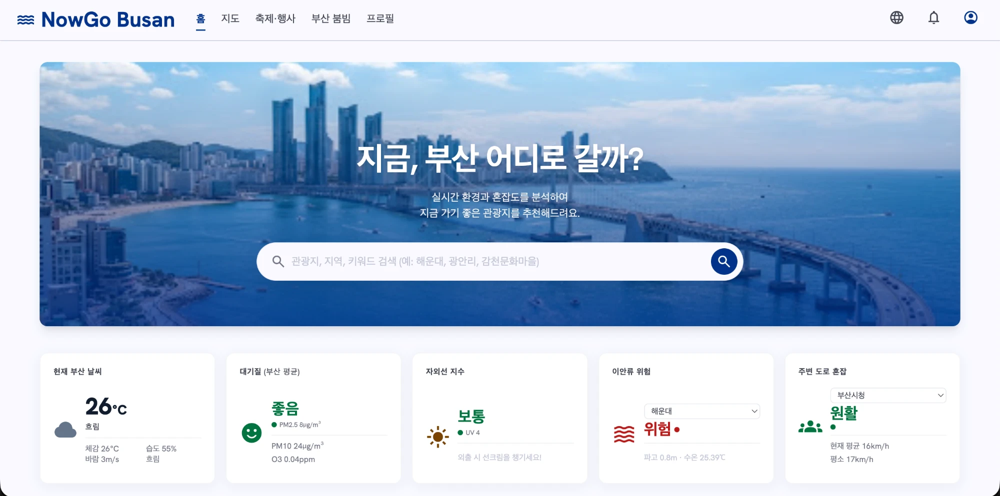

---

## 💡 소개

비 오는 해운대, 미세먼지 낀 산책로, 이안류 경보가 뜬 해변. 관광지 정보는 많지만 **"지금 가도 괜찮은지"** 는 알기 어렵습니다.

NowGo Busan은 공공 OpenAPI의 실시간 **대기·기온·강수·자외선·해양 지수**를 관광지 좌표에 붙여 **NowGo Score(0~100)** 와 **신호등(🟢 🟡 🔴)** 으로 보여 주고, 도로 소통 데이터로 **주변 혼잡도**까지 알려 줍니다.

## ✨ 주요 기능

| 기능 | 설명 |
|---|---|
| 🗺️ **지도** | 카카오맵 위에 관광지를 유형별 마커로 표시, 밀집 지역은 클러스터링 |
| 🚦 **NowGo Score** | 관광지별 점수·신호등, "왜 이 점수인지" 이유와 행동 지침 제공 |
| 🏖️ **해양 활동 점수** | 해변은 해수욕·서핑·바다여행을 활동별로 따로 평가 (이안류 반영) |
| 🚗 **부산 붐빔** | 도로 통행속도를 같은 요일·시간대 평소와 비교한 주변 혼잡도 |
| 🎪 **축제·행사** | TourAPI·KOPIS·부산문화포털 다봄을 통합·중복 제거, 담은 행사만 보는 캘린더 |
| 🔔 **기상특보 알림** | 부산 기상특보를 알림벨·토스트로 즉시 안내 |
| 🌏 **다국어** | 한국어 · English · 中文 |
| ⭐ **저장 목록** | 카카오·구글 소셜 로그인 후 관광지 목록 저장 |
| 🛠️ **관리자** | 데이터 수집 현황 점검, 행사 중복 검토, 사용자 관리 |

> 🔒 **위치정보 최소화** — 사용자 GPS 좌표를 서버로 보내지 않습니다. 지도 "내 위치" 버튼도 기기 안에서만 동작합니다.

> ⏳ **주변 혼잡도 안내** — 도로 소통 데이터를 매시간 수집해 요일·시간대별 평소 속도(baseline)를 쌓는 중입니다. 3주 이상 누적되면 정식 표시하고, 그 전에는 구·군 단위 평소 방문 패턴 기반 참고값으로 보완합니다.

## 📸 화면 미리보기

<table>
  <tr>
    <td align="center">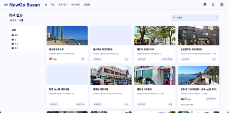<br /><sub>검색 결과</sub></td>
    <td align="center">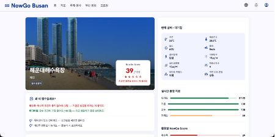<br /><sub>관광지 상세 · 점수 이유</sub></td>
    <td align="center">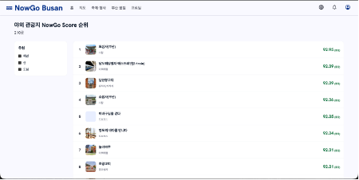<br /><sub>NowGo Score 순위</sub></td>
  </tr>
  <tr>
    <td align="center">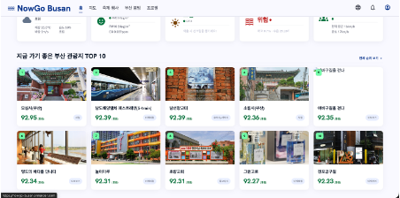<br /><sub>지금 가기 좋은 TOP 10</sub></td>
    <td align="center">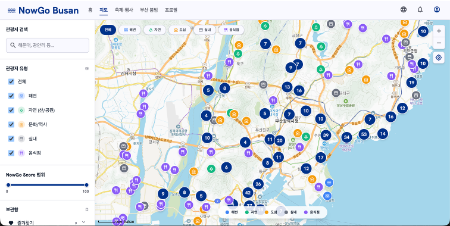<br /><sub>지도 · 클러스터링</sub></td>
    <td align="center">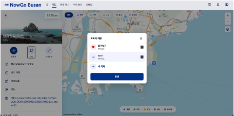<br /><sub>저장 목록에 담기</sub></td>
  </tr>
  <tr>
    <td align="center">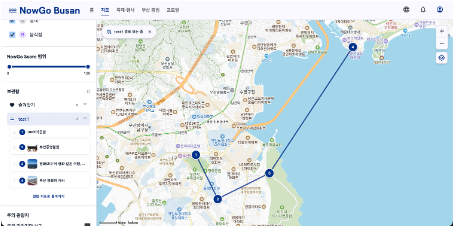<br /><sub>저장 목록 · 지도 경로</sub></td>
    <td align="center">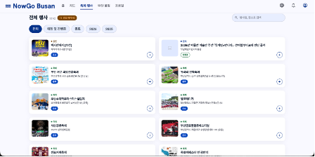<br /><sub>축제·행사</sub></td>
    <td align="center">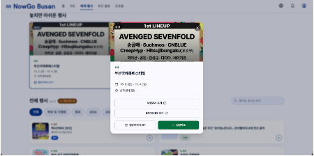<br /><sub>행사 상세</sub></td>
  </tr>
  <tr>
    <td align="center">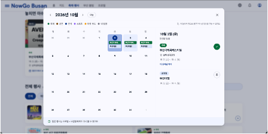<br /><sub>내 행사 캘린더</sub></td>
    <td align="center">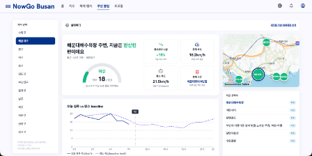<br /><sub>부산 붐빔 · 주변 혼잡도</sub></td>
    <td></td>
  </tr>
</table>

## 🚦 NowGo Score는 이렇게 계산해요

야외 관광지를 대상으로, 관광지 좌표에서 가장 가까운 관측 데이터를 골라 항목별 점수(0~100)를 냅니다.

| 분류 | 반영 항목 | 가중치 |
|---|---|---|
| 도심·일반 | 대기 · 기온 · 강수 · 자외선 | 각 0.25 |
| 해변 | 위 4개 + 해양 활동(해수욕 / 서핑 / 바다여행) | 각 0.20, 활동별로 점수 산출 |

- **위험 상한** — 위험 요소가 하나라도 있으면 초록이 될 수 없고, 심한 위험(이안류 위험·폭염·호우 등)은 빨강으로 고정
- **신호등** — 80점 이상 🟢 · 40~79점 🟡 · 40점 미만 🔴
- **결측 처리** — 필요한 항목이 빠지면 점수를 내지 않음 (자외선만 결측이면 나머지로 재정규화)
- 혼잡도는 점수에 섞지 않고 **주변 혼잡도로 별도 표시**

## 📡 활용 데이터 (공식 OpenAPI)

| 제공기관 | 데이터 | 용도 |
|---|---|---|
| 한국관광공사 | TourAPI 국문·영문·중문 관광정보, 축제·행사 | 관광지·상세·다국어·행사 |
| 한국관광공사 | 관광빅데이터 지역별 방문자수 | 구·군 혼잡 baseline |
| 한국환경공단 | 에어코리아 대기오염정보·측정소정보 | 대기 점수 |
| 기상청 | 단기예보, 생활기상지수(UV), 지상관측 격자, 기상특보 | 기온·강수·자외선·알림 |
| 국립해양조사원 | 이안류, 해수욕지수, 서핑지수, 바다여행지수 | 해양 활동 점수 |
| 부산광역시 | 링크(도로) 소통정보 | 주변 혼잡도 |
| KOPIS · 부산문화포털 다봄 | 공연·전시 정보 | 행사 |
| 한국천문연구원 | 특일(공휴일) 정보 | 혼잡 baseline 보정 |
| 카카오 | 카카오맵, 카카오 로그인 | 지도·로그인 |

## 🏗️ 아키텍처

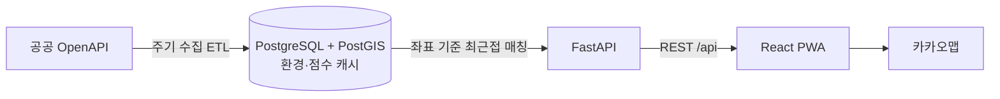

- **ETL** — Render Cron이 1시간 주기로 환경 데이터를 수집하고, 마지막 단계에서 NowGo Score를 미리 계산해 캐시에 저장
- **API** — 요청 시 외부 API를 부르지 않고 캐시만 읽음 (호출 한도·응답 속도 대응)
- **공간 쿼리** — 관광지 좌표 ↔ 측정소·관측점 매칭은 PostGIS로 처리

## 🛠️ 기술 스택

| 영역 | 사용 기술 |
|---|---|
| Frontend | React 19, Vite, Tailwind CSS, React Router, i18next, 카카오맵 JS SDK, PWA |
| Backend | Python 3.11, FastAPI, SQLAlchemy 2, Alembic, GeoAlchemy2 |
| Database | PostgreSQL + PostGIS |
| Infra | Render (Web Service + Cron Job) |

## 📁 디렉터리 구조

```
NowGo_Busan/
├── frontend/          # React + Vite PWA
│   └── src/           # pages · components · services · locales(ko/en/zh)
├── backend/
│   ├── routers/       # API 엔드포인트
│   ├── services/      # 환경 점수·NowGo Score·혼잡도 계산
│   ├── db/            # 모델 · PostGIS 공간 쿼리
│   └── etl/           # 공공 API 수집 배치
└── render.yaml        # 배포 설정
```

## 🚀 실행 방법

```bash
# Backend  (Python 3.11 · PostGIS DB 필요: backend/docker-compose.yml)
cd backend
python3.11 -m venv venv && source venv/bin/activate
pip install -r requirements.txt
cp .env.example .env            # API 키·DB 정보 입력
uvicorn main:app --reload --port 8080

# 데이터 수집 + 점수 계산
python -m etl.fetch_environment_batch
python -m etl.compute_nowgo_scores

# Frontend
cd frontend
cp .env.example .env            # VITE_KAKAO_JS_API_KEY 등
npm install && npm run dev
```

> API 키는 `.env`에만 두며 커밋하지 않습니다. 프론트에는 카카오 JS 키만 두고, 도메인 제한을 겁니다.

## 📄 데이터 고지

사용하는 공공·민간 API는 각 제공 기관의 이용약관과 호출 한도를 따르며, 개인을 식별할 수 없는 집계 데이터만 사용합니다.
출처: ⓒ한국관광공사

<!-- TODO: 팀 소개 (이름 · 역할 · GitHub) -->
